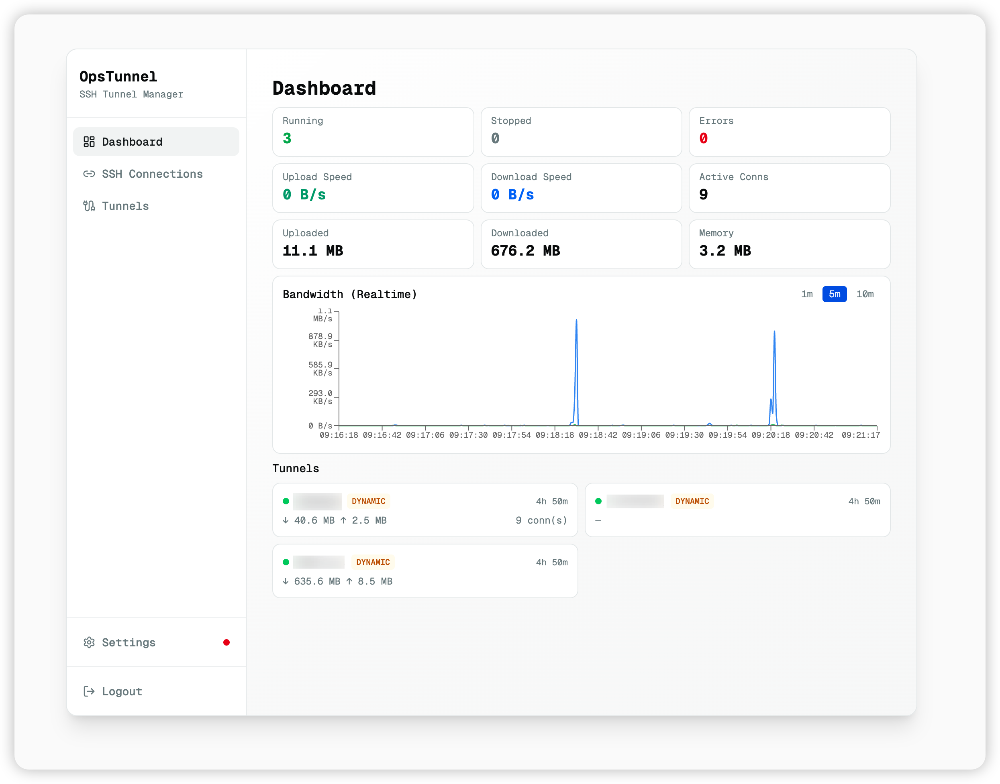
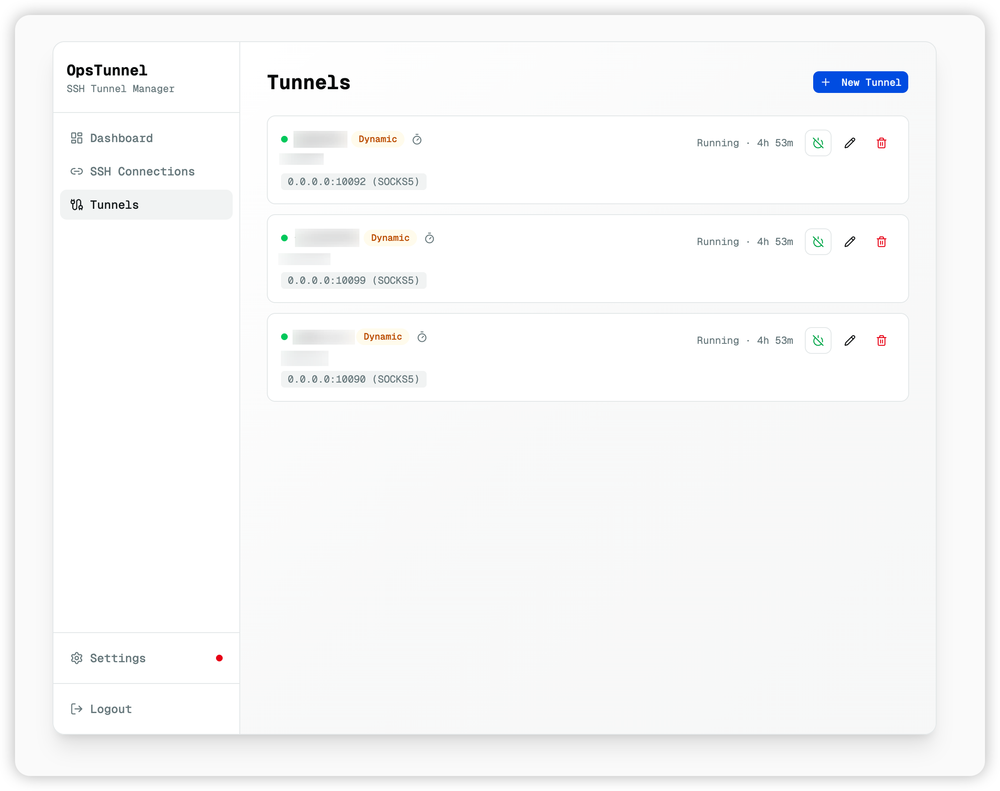
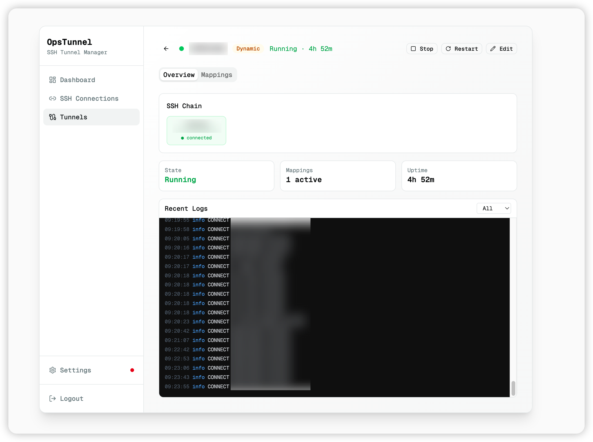
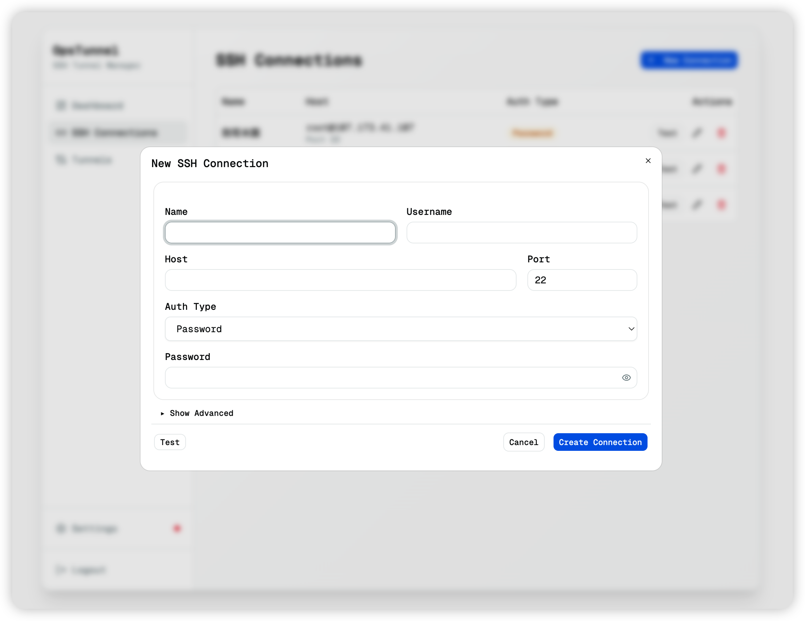

# OpsTunnel

A cross-platform SSH tunnel manager that lets you create, monitor, and auto-reconnect SSH tunnels through a visual interface — available as a desktop app, web UI, or Docker container.

## Screenshots

<!-- TODO: Add screenshots -->









## Features

- **Multi-hop tunnel chains** — Access internal databases, APIs, or services through one or more jump hosts
- **SOCKS5 proxy** — Browse internal networks via dynamic tunnels, with optional username/password auth and IP allow/deny lists
- **Three tunnel modes** — Local forwarding (-L), Remote forwarding (-R), and Dynamic SOCKS5 (-D)
- **Auto reconnect** — Tunnels automatically recover from connection drops with configurable retry behavior
- **Traffic dashboard** — Real-time bandwidth chart, per-tunnel traffic stats, and connection counts
- **Web authentication** — Login page with session cookies for server/Docker deployments; bearer token for API access
- **Desktop app** — Native window with system tray icon that shows tunnel status at a glance
- **Docker ready** — One-command deployment with persistent data volume
- **Multi-language** — English and Simplified Chinese

## Install

### Desktop

Download the latest release for your platform from [Releases](https://github.com/maxzhang666/ops-tunnel/releases).

### Docker

```bash
docker run -d --name ops-tunnel \
  -p 9876:9876 \
  -v tunnel-data:/data \
  -e TUNNEL_ADMIN_USERNAME=admin \
  -e TUNNEL_ADMIN_PASSWORD=your-password \
  ghcr.io/maxzhang666/ops-tunnel:latest
```

Open http://localhost:9876 and sign in with the username and password you set.

### Docker Compose

```bash
curl -O https://raw.githubusercontent.com/maxzhang666/ops-tunnel/main/docker-compose.yml
docker compose up -d
```

### Server Binary

```bash
./tunnel-server --listen 127.0.0.1:9876 --data-dir ./data
```

## Configuration

All options can be set via CLI flags or environment variables. Environment variables take effect when the corresponding flag is not explicitly provided.

| Variable | Flag | Default | Description |
|----------|------|---------|-------------|
| `TUNNEL_LISTEN` | `--listen` | `127.0.0.1:9876` | HTTP listen address |
| `TUNNEL_DATA_DIR` | `--data-dir` | `./data` | Directory for config, auth, and traffic data |
| `TUNNEL_UI_DIR` | `--ui-dir` | (embedded) | Path to static UI files (overrides embedded UI) |
| `TUNNEL_TOKEN` | `--token` | (none) | Bearer token for API-only authentication |
| `TUNNEL_ADMIN_PASSWORD` | — | (none) | Set admin password for Web UI login. Omit to disable login |
| `TUNNEL_ADMIN_USERNAME` | — | `admin` | Admin username (used with `TUNNEL_ADMIN_PASSWORD`) |

When `TUNNEL_ADMIN_PASSWORD` is not set, the Web UI is accessible without authentication.

## License

MIT
